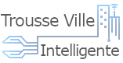

# Accueil

## À la découverte de la ville intelligente

La présente trousse décrit plusieurs des applications existantes et des outils actuels qui rendent une ville intelligente. Explorez le paysage urbain ci-dessous pour découvrir les activités et les services municipaux qui caractérisent une ville intelligente. Cliquez sur la carte pour en apprendre davantage sur une application ou une technologie donnée. Les solutions retenues pour une ville intelligente ne devraient pas être adaptées aveuglément, mais plutôt être mises en place en en évaluant et documentant les risques et les conséquences imprévues. Les risques communs et leur gestion sont indiqués pour chacune des solutions décrites.

Nous avons indiqué sous le paysage urbain cinq métapréoccupations : vie privée, sécurité, approvisionnement, propriété intellectuelle et inclusion. Ces métapréoccupations sont soulevées régulièrement lorsque les municipalités soupèsent, choisissent et instaurent des approches intelligentes pour la prestation de leurs services. En cliquant sur chaque métapréoccupation, vous en apprendrez davantage sur la manière d’y répondre, ainsi que sur les ressources et les outils nécessaires pour le faire de façon proactive.

## À propos de la trousse 

La trousse Ville intelligente vous a été mise à votre disposition grâce à un investissement d'[Infrastructure Canada](https://www.infrastructure.gc.ca/cities-villes/index-eng.html) et au travail acharné des étudiants en droit du [CIPPIC, la Clinique d'intérêt public et de politique Internet canadienne Samuelson-Glushko](https://cippic.ca/) de la [Section de common law de la Faculté de droit, Université d'Ottawa](https://commonlaw.uottawa.ca/en).

